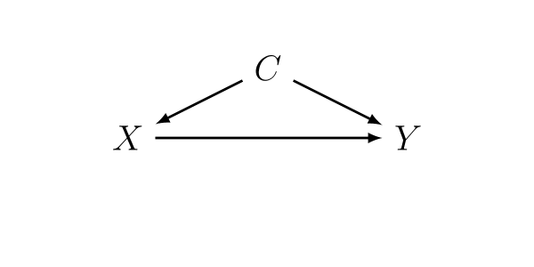
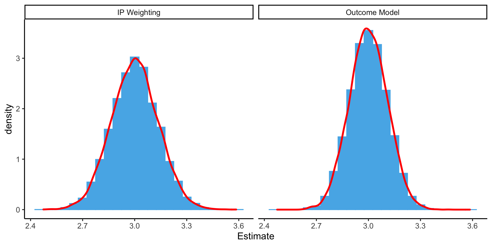

class: title-slide, left, bottom

<font size="50"> Monte Carlo Simulation: Some Fundamentals </font> 

<br><br><br><br><br><br>

**Ashley I Naimi, PhD** <br> Associate Professor <br> Emory University <br>

`r icon::fontawesome("envelope")` &nbsp; ashley.naimi@emory.edu <br> `r icon::fontawesome("twitter")` &nbsp; @ashley_naimi <br> `r icon::fontawesome("github")` &nbsp; ainaimi <br>


```{r startup, include = FALSE, message = FALSE, warning = FALSE}
library(tidyverse)
library(sandwich)
library(lmtest)
library(glue)

thm <- theme_classic() +
  theme(
    legend.position = "top",
    legend.background = element_rect(fill = "transparent", colour = NA),
    legend.key = element_rect(fill = "transparent", colour = NA)
  )
theme_set(thm)

options(digits = 3, width = 110)

hexes <- function(x) {
  x <- rev(sort(x))
  bad_svg <- c("dplyr", "tidyr")
  x <- ifelse(x %in% bad_svg, paste0(x, ".png"), paste0(x, ".svg"))
  markup <- function(pkg) glue::glue('')
  res <- purrr::map_chr(x, markup)
  paste0(res, collapse = "")
}
```

---
# Simulations

.font150[

* General Principles

* Types of Simulation

* Let's Simulate

* Analyzing and Reporting

* Considerations

* Further Exploration

]

---
# General Principles behind Data Simulation

.font150[

* Why Simulate? 

    * Exploring
    
    * Learning
    
    * Teaching
    
    * Research
    
]

---
# General Principles behind Simulation

.font150[


* Every sample has an underlying cohort
    
* Clean code
    
* Efficient code
    
* Reproducible code

]

---
# Types of Simulation

.font150[

* <span style="color: red"> Systems Dynamics and Agent Based Models </span>

* <span style="color: red"> The Parametric G Formula (aka G Computation) </span>
    
* Monte Carlo Simulation 

    * Regular 
    
    * Plasmode

]

---
# Let's Simulate Data

.pull-left-a-little[

```{r simple_dag, echo = FALSE, out.width = "400px", fig.align="center"}

```

]

--

.pull-right-a-lot[

```{r simulations_1}

set.seed(123)
expit <- function(x){1/(1+exp(-x))}
n <- 500
id <- 1:500
c1 <- rbinom(n, 1, .5)
c2 <- rbinom(n, 1, .5)
x <- rbinom(n,1,expit(-2 + log(2)*c1 + log(2)*c2))
y <- 30 + 3*x + 3*c1 + 3*c2 + rnorm(n,0,1)

sim_dat <- data.frame(id,y,x,c1,c2)

head(sim_dat)

```


]

---
# Let's Simulate Data

```{r simulations_2}

mod1 <- glm(y ~ x + c1 + c2, data=sim_dat,family=gaussian("identity"))
coeftest(mod1, vcov = vcov(mod1))[2,]

```

```{r simulations_3}

ps <- glm(x ~ c1 + c2, data=sim_dat,family=binomial("logit"))$fitted.values
sim_dat$sw <- x*(mean(x)/ps) + (1-x)*((1-mean(x))/(1-ps))
summary(sim_dat$sw)

mod2 <- glm(y ~ x, data=sim_dat,family=gaussian("identity"),weights=sw)
coeftest(mod2, vcov = vcovCL(mod2, cluster=sim_dat$id, type = "HC1"))[2,]

```

--

.font150[

<span style="color: red"> How different are the estimates of $\beta_X$ when using outcome regression versus IP weighting? </span>

]

---
# Simulation Study

```{r simulations_study}

set.seed(123)
expit <- function(x){1/(1+exp(-x))}

simulation_function <- function(z){
  n <- 500
  id <- 1:500
  c1 <- rbinom(n, 1, .5)
  c2 <- rbinom(n, 1, .5)
  x <- rbinom(n,1,expit(-2 + log(2)*c1 + log(2)*c2))
  y <- 30 + 3*x + 3*c1 + 3*c2 + rnorm(n,0,1)

  sim_dat <- data.frame(id,y,x,c1,c2)
  
  mod1 <- glm(y ~ x + c1 + c2, data=sim_dat,family=gaussian("identity"))
  coef1 <- coeftest(mod1, vcov = vcov(mod1))[2,1:2]
  
  ps <- glm(x ~ c1 + c2, data=sim_dat,family=binomial("logit"))$fitted.values
  sim_dat$sw <- x*(mean(x)/ps) + (1-x)*((1-mean(x))/(1-ps))

  mod2 <- glm(y ~ x, data=sim_dat,family=gaussian("identity"),weights=sw)
  coef2 <- coeftest(mod2, vcov = vcovCL(mod2, cluster=sim_dat$id, type = "HC1"))[2,1:2]
  
  res <- rbind(cbind(1,t(coef1)),
               cbind(2,t(coef2)))
  
  return(res)
}

```

---
# Simulation Study

```{r simulations_study2}

set.seed(123)
res <- lapply(1:10000, function(ii) simulation_function(ii))
res <- do.call(rbind,res)
res <- data.frame(res)
names(res) <- c("Model","Estimate","SE")
head(res)

res %>% group_by(Model) %>% summarize(bias = mean(3 - Estimate),
                                      sd_beta = sd(Estimate),
                                      se_beta = mean(SE))

```

---
# Simulation Study

```{r simulations_study3, message=F,warning=F,include=F}

res <- res %>% mutate(Model = if_else(Model==1,"Outcome Model","IP Weighting"))
plot1 <- ggplot(res, aes(Estimate)) + 
                    geom_histogram(aes(y=..density..),binwidth=.05, colour="#56B4E9", fill="#56B4E9") +
                    geom_density(aes(Estimate),color="red",size=1) +
                    facet_wrap(~Model)

ggsave("./images/sim_res.png", width=20, height=10, units="cm")

```

```{r sim-res, echo = FALSE, out.width = "1000px", fig.align="center"}

```

---
# Setting up and Analyzing Simulation Data

.font150[

* Monte Carlo simulations are experiments

* For a Monte Carlo sample size $M$, with error $e$ 

    * for error in bias, $M = \frac{SD\{ \hat{B}_M(\psi)^2 \} }{e^2}$
    
    * for error in proportions, $M = \frac{4 p (1-p)}{e^2}$

]

---
# Simulation Considerations

.font150[

* Output and save more than you might need

* Keep MC samples small at first

* Be aware of how you parameterized the simulations

     * Leaving something (e.g., interaction) is assuming something is zero!

]

---
# For Further Exploration

.font150[

* R functions

* lapply, mapply, and mclapply

* parallel processing

]

---

# Some Papers for Further Reading

.font150[

* Morris et al (2019) Using simulation studies to evaluate statistical methods. Stat Med. 38(11): 2074-2102.

* Rudolph et al (2020) Simulation as a Tool for Teaching and Learning Epidemiologic Methods. Am J Epidemiol. https://doi.org/10.1093/aje/kwaa232

* Rudolph et al (2021) Simulation in Practice: The Balancing Intercept. Am J Epidemiol. https://doi.org/10.1093/aje/kwab039

]
